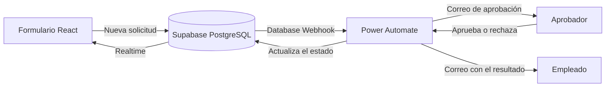

# Portal de permisos

Aplicación web para solicitar permisos laborales con **aprobación automática por correo**. El empleado envía la solicitud, el aprobador responde desde su bandeja y el estado se actualiza en pantalla en tiempo real, sin recargar.


## Qué hace

- Formulario de solicitud con validación de fechas y cálculo automático de días.
- Aprobación por correo con botones Aprobar y Rechazar, gestionada por Power Automate.
- Historial por empleado con filtros por estado (pendiente, aprobada, rechazada).
- Actualización en vivo: la tarjeta cambia de estado cuando el aprobador responde.
- Correo final al empleado con el resultado y el comentario del aprobador.
- Diseño responsivo que ocupa la pantalla completa, con pestañas en celular.

## Cómo funciona



1. El empleado envía la solicitud y Supabase la guarda con estado `pendiente`.
2. Un Database Webhook (solo en `INSERT`) avisa al flujo de Power Automate.
3. El flujo crea una aprobación y envía el correo al aprobador.
4. Al responder, el flujo actualiza la fila con una llamada `PATCH` a la API REST de Supabase.
5. Supabase Realtime empuja el cambio al navegador y la interfaz se actualiza.
6. El flujo envía al empleado un correo con el resultado.

## Tecnologías

| Capa           | Herramientas                                       |
| -------------- | -------------------------------------------------- |
| Interfaz       | React, TypeScript, Vite, Tailwind CSS              |
| Datos          | Supabase (PostgreSQL, Realtime, Database Webhooks) |
| Automatización | Power Automate (Aprobaciones, HTTP, Outlook)       |
| Despliegue     | Vercel                                             |

## Estructura

```
.
├── src/
│   ├── App.tsx
│   ├── Permisos.tsx      # formulario e historial
│   ├── main.tsx
│   └── index.css
├── supabase/
│   └── schema.sql        # tabla, políticas RLS y realtime
├── .env.example
└── README.md
```

## Instalación local

Requisitos: Node.js 18 o superior y un proyecto de Supabase.

```bash
git clone https://github.com/AndesRo/portal-permisos.git
cd portal-permisos
npm install
cp .env.example .env
```

1. En Supabase, abre `SQL Editor`, pega el contenido de `supabase/schema.sql` y ejecútalo.
2. Completa `.env` con la URL y la clave pública (`anon` o `publishable`) de tu proyecto, que están en `Project Settings` → `API`.
3. Inicia la aplicación:

```bash
npm run dev
```

La aplicación queda disponible en `http://localhost:5173`.

## Variables de entorno

| Variable                 | Descripción                                              |
| ------------------------ | -------------------------------------------------------- |
| `VITE_SUPABASE_URL`      | URL del proyecto, por ejemplo `https://xxxx.supabase.co` |
| `VITE_SUPABASE_ANON_KEY` | Clave pública del proyecto                               |

Usa solo la clave pública en el frontend. La clave secreta (`service_role` o `secret key`) nunca debe estar en este repositorio ni en las variables de Vercel: solo la usa el flujo de Power Automate.

## Configurar el flujo de Power Automate

1. **Disparador:** "Cuando se recibe una solicitud HTTP", con _Quién puede desencadenar el flujo_ en **Cualquiera** y el esquema del webhook de Supabase.
2. **Aprobación:** "Iniciar y esperar una aprobación", tipo _Aprobar/Rechazar: el primero en responder_. Asigna al aprobador y arma el título y los detalles con los datos del registro (`record`).
3. **Actualización:** acción HTTP con método `PATCH` a `https://TU_PROYECTO.supabase.co/rest/v1/solicitudes_permiso?id=eq.{id}`.
   - Encabezados: `apikey` (clave secreta), `Content-Type: application/json` y `Prefer: return=minimal`.
   - Cuerpo: `estado` (`aprobado` o `rechazado` según el resultado), `comentario_aprobador` y `resuelto_en`.
4. **Notificación:** "Enviar un correo electrónico (V2)" al `empleado_email` con el resultado.
5. **No agregues una acción "Respuesta".** El disparador responde 202 de inmediato y el flujo espera la aprobación en segundo plano, lo que evita el tiempo de espera del webhook.

Después, en Supabase, abre `Integrations` → `Database Webhooks` y crea un webhook sobre `solicitudes_permiso`, solo en **Insert**, método `POST`, con la URL del disparador del flujo.

## Despliegue en Vercel

1. Importa el repositorio en [vercel.com/new](https://vercel.com/new). Vercel detecta Vite automáticamente.
2. Agrega las variables `VITE_SUPABASE_URL` y `VITE_SUPABASE_ANON_KEY`.
3. Pulsa `Deploy`.

Cada cambio en `main` se despliega de forma automática.

## Seguridad y límites actuales

- Las políticas RLS permiten lectura e inserción públicas para el rol `anon`. El historial se filtra por correo en la interfaz, pero eso no impide leer los datos directamente desde la API.
- La actualización del estado no la hace el navegador: la realiza el flujo con la clave secreta, que está fuera del código.
- Los datos de ejemplo deben ser ficticios mientras la aplicación no tenga autenticación.

## Próximos pasos

- Autenticación con Supabase Auth y políticas RLS por usuario.
- Rol de aprobador con panel propio.
- Notificaciones en Microsoft Teams.
- Reportes de permisos por área y período.

## Autor

Andrés Romero, desarrollador, automatización de procesos.

[LinkedIn](https://www.linkedin.com/in/romeromllq/) · [GitHub](https://github.com/AndesRo)
